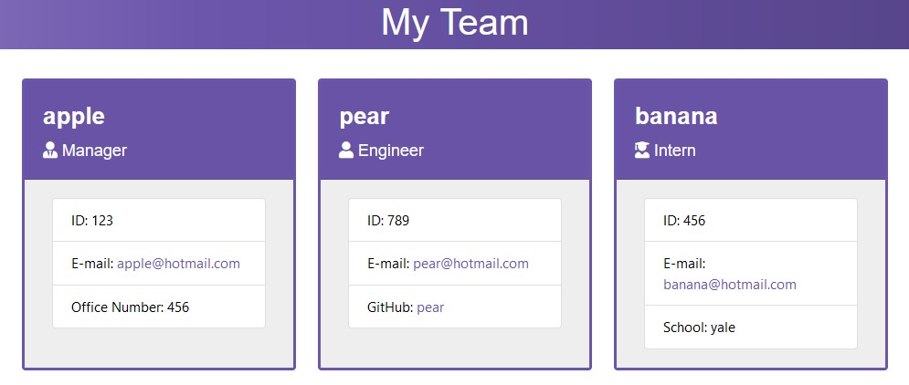

# Team Profile Generator

## Purpose
A Node.js command-line application that takes in information about employees on a software engineering team and generates a HTML webpage that displays summaries for each person.

## Website
https://tw2159.github.io/Team-Profile-Generator/

## Video Walkthrough
https://watch.screencastify.com/v/ePBQg4o9i23VJrpUtVhP

## Screenshot

## Built With
* HTML
* CSS
* Bootstrap
* NodeJS
* npm
* Inquirer
* Jest

## Contribution
Made with ❤️ by Te Wei